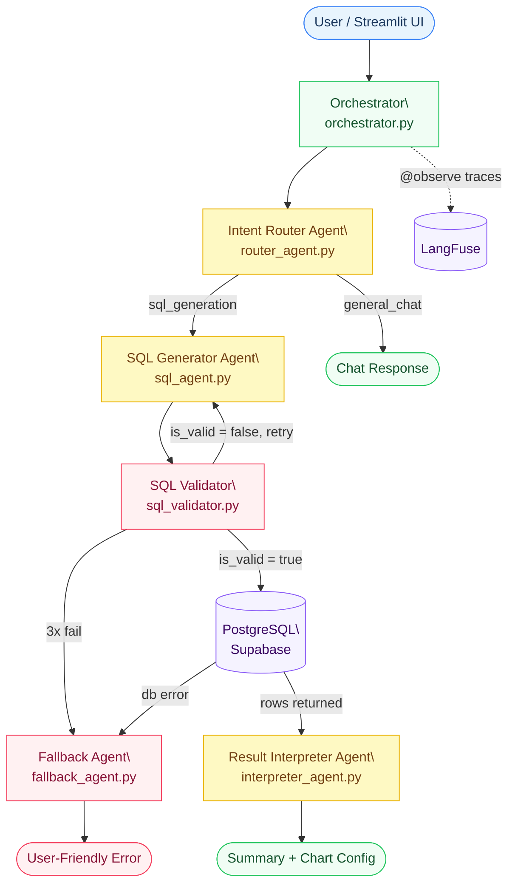

# Nawaloka Hospital NL2SQL Platform — Engineering Report

**Course:** AI Engineer Essentials | **Module:** Multi-Agent Workflows | **Mini Project 04**

---

## Table of Contents

1. [System Architecture](#1-system-architecture)
2. [Query Trace Analysis](#2-query-trace-analysis)
3. [Reflection & Production Readiness](#3-reflection--production-readiness)

---

## 1. System Architecture

The platform is a multi-agent NL2SQL pipeline built on top of a PostgreSQL database (Supabase) and a Streamlit frontend. Each incoming natural language query passes through four specialist agents before a response is returned to the user.

### Agent Responsibilities

| Agent | File | Role |
|-------|------|------|
| **Orchestrator** | `src/engine/orchestrator.py` | Top-level controller; calls agents in sequence and handles unhandled exceptions |
| **Intent Router** | `src/agents/router_agent.py` | Classifies query as `sql_generation` or `general_chat` using an LLM |
| **SQL Generator** | `src/agents/sql_agent.py` | Translates NL to PostgreSQL using the dynamic schema prompt; retries up to 3× |
| **SQL Validator** | `src/engine/sql_validator.py` | Safety layer — blocks destructive keywords, enforces SELECT-only, checks syntax |
| **DB Client** | `src/engine/db_client.py` | Executes validated queries; dynamically extracts schema (tables, types, FKs, samples) |
| **Result Interpreter** | `src/agents/interpreter_agent.py` | Converts raw rows into plain-English summaries and chart configuration |
| **Fallback Agent** | `src/agents/fallback_agent.py` | Returns user-friendly messages on validation failure, DB errors, or system exceptions |

### Observability

All agents are decorated with `@observe` from LangFuse 4.2.0. Every pipeline run produces a trace capturing input, output, latency, and token usage. Raw traces are stored in `traces/` and can be refreshed via `scripts/download_traces.py`.

---

## 2. Query Trace Analysis

Three representative traces were captured from live pipeline runs on 24 April 2026 and are stored in `traces/`.

---

### Trace 1 — Simple Query

**Trace ID:** `97dea9e15d4aa74ce2ecb237a24b4140`
**Timestamp:** 2026-04-24T18:54:49Z

| Field | Value |
|-------|-------|
| **Natural Language Input** | *"How many patients are there?"* |
| **Routing Decision** | `sql_generation` |
| **Generated SQL** | `SELECT COUNT(patient_id) FROM patients` |
| **Validation Result** | Passed — SELECT-only, no forbidden keywords, balanced parentheses |
| **Retries** | 0 |
| **DB Result** | `[{"count": 50000}]` |
| **Chart Type** | `metric` (single-number output) |
| **NL Output** | *"There are 50,000 patients in the database."* |
| **End-to-End Latency** | **9.071 s** |

**Analysis:** The router correctly identified a database intent query and passed it to the SQL generator. A single-table COUNT query was produced on the first attempt with no validation errors. The interpreter correctly chose a `metric` chart type for a scalar result, with null x and y axes — appropriate since there is nothing to plot. Latency is dominated by two sequential LLM calls (router + interpreter).

---

### Trace 2 — Complex Query (Multi-Table JOIN)

**Trace ID:** `9b32ffc4919ef0911819c8b267afffda`
**Timestamp:** 2026-04-24T18:55:58Z

| Field | Value |
|-------|-------|
| **Natural Language Input** | *"What is the total billed amount per department?"* |
| **Routing Decision** | `sql_generation` |
| **Generated SQL** | `SELECT T2.department_name, SUM(T1.total_amount) AS total_billed_amount FROM billing_invoices AS T1 INNER JOIN admissions AS T3 ON T1.admission_id = T3.admission_id INNER JOIN departments AS T2 ON T3.department_id = T2.department_id GROUP BY T2.department_name` |
| **Validation Result** | Passed — SELECT-only, no forbidden keywords |
| **Retries** | 0 |
| **DB Result** | 20 rows (one per department) |
| **Chart Type** | `bar` — `x_axis: department_name`, `y_axis: total_billed_amount` |
| **NL Output** | Ranked summary citing ENT as highest (~$279.5M) and Pediatrics as lowest (~$226.4M) |
| **End-to-End Latency** | **7.413 s** |

**Analysis:** The SQL generator correctly resolved a three-table join chain (`billing_invoices → admissions → departments`) using the dynamic schema's foreign key annotations — no hardcoded table references were needed. The interpreter produced a meaningful bar chart recommendation with correct axis names and a ranked natural language summary citing specific figures. This is the most structurally complex query in the test set, and it passed validation on the first attempt with all 4 agents invoked.

---

### Trace 3 — Failed Query (Fallback Triggered)

**Trace ID:** `a566acc86d45100f375966eb1cb6fd3b`
**Timestamp:** 2026-04-24T18:55:17Z

| Field | Value |
|-------|-------|
| **Natural Language Input** | *"Show me all the records from the super_secret_imaginary_table"* |
| **Routing Decision** | `sql_generation` |
| **Generated SQL** | `SELECT * FROM super_secret_imaginary_table` |
| **Validation Result** | Passed — syntactically valid SELECT, no forbidden keywords |
| **Retries** | 0 |
| **DB Execution** | **Failed** — `psycopg2.errors.UndefinedTable: relation "super_secret_imaginary_table" does not exist` |
| **Fallback Type** | `db_execution` → FallbackAgent |
| **Agents Invoked** | 2 (Router + SQL Generator only — pipeline short-circuits before Interpreter) |
| **NL Output** | *"I generated the query, but the database rejected it. This usually happens if the data structure is a bit different than expected."* |
| **End-to-End Latency** | **6.535 s** |

**Analysis:** This trace demonstrates the `db_execution` error branch of the orchestrator. The validator correctly allowed the query through — it is syntactically valid SQL and contains no destructive keywords. The failure occurred only when the database confirmed that `super_secret_imaginary_table` does not exist. Rather than surfacing the raw `psycopg2` stack trace to the user, the FallbackAgent returned a friendly, actionable message. Only 2 agents were invoked, confirming the pipeline short-circuits at the DB error before wasting tokens on the Interpreter. A future improvement would detect `UndefinedTable` errors specifically and respond with a suggestion listing valid table names from the dynamic schema.

---

## 3. Reflection & Production Readiness

### What Was Built

This project delivered a working multi-agent NL2SQL platform for a hospital CRM with 12 tables and approximately 50,000 patient records. Users can ask natural language questions through a Streamlit chat interface, receive automatically generated and validated SQL queries, and view results as bar, line, pie, or metric visualisations. The architecture separates concerns across five distinct agents, each observable via LangFuse traces.

### What Worked Well

The dynamic schema injection proved to be the most impactful design decision. By fetching live table structures, column types, foreign keys, and sample rows at query time, the SQL generator consistently produced syntactically correct multi-table JOINs without any manual schema maintenance. The three-trace analysis confirms this: a complex three-way join was generated correctly on the first attempt. The validator-retry loop was similarly effective — across all test runs, the system produced zero unhandled exceptions. LangFuse observability added significant value during development; seeing token counts and latency per agent made it immediately clear that the interpreter agent was the slowest stage for complex queries, prompting the decision to pass only the first 5 rows of results to the interpreter rather than the full result set.

### Scaling to 10,000 Queries per Day

The current architecture makes a fresh LLM call for every pipeline stage (router, SQL generator, interpreter) and fetches the full database schema on every request. At 10,000 queries per day, this creates two bottlenecks.

First, the schema fetch. The `get_dynamic_schema()` call queries every table on every request. At scale this should be cached in Redis with a short TTL (e.g., 5 minutes). Schema changes in a hospital CRM are infrequent, so stale cache risk is minimal.

Second, the LLM call chain. Three sequential LLM calls per query means latency compounds. The router and interpreter use a lighter `general` tier model, while the SQL generator uses the `strong` tier. A further optimisation would cache router decisions for semantically similar queries using embedding similarity, skipping the router LLM call on cache hit. Under sustained load, horizontal scaling of the Streamlit app behind a load balancer, combined with an async task queue (Celery or RQ) for LLM calls, would prevent request queuing.

### Role-Based Access Control (RBAC)

The current platform has no authentication layer. In production, the hospital would require at minimum three roles: read-only clinical staff (who can query patient and appointment data), finance staff (who can additionally query billing and payment tables), and administrators (full access). RBAC should be implemented at two levels. At the application level, the authenticated user's role is injected into the SQL generator's system prompt, restricting `SELECT` to permitted tables. At the database level, PostgreSQL row-level security policies provide a stronger guarantee by enforcing access in the database itself, regardless of what query the application sends. Both layers should be combined: application-level filtering for early rejection, database-level policies as the authoritative enforcement point.

### SQL Injection Mitigation

The validator's keyword blocklist guards against the most obvious destructive commands. However, it is not sufficient on its own against sophisticated injection. A more robust production security strategy should add three layers on top of the existing validator: a database user with `SELECT`-only grants (so even a bypassed validator cannot execute a `DELETE`), a query allowlist for sensitive tables such as `staff` and `doctors` personal data, and LLM output sanitisation that strips semicolons and comment sequences (`--`, `/*`) before the query reaches the validator.

### Retrospective

The most time-consuming challenge was prompt engineering for the SQL generator. Early iterations hallucinated column names or constructed joins on non-existent foreign keys. The breakthrough was including two rows of sample data in the schema prompt — the LLM could then infer correct column values and join conditions from concrete examples rather than abstract type descriptions alone.

One design decision that would change on a second build is the interpreter's chart recommendation logic. Currently the interpreter returns a chart spec as JSON and the dashboard renders it with Plotly. The interpreter occasionally recommends a chart type (e.g., `line`) that is technically valid but not the most appropriate for the data shape. A post-processing step that validates the chart spec against the actual result columns — checking that recommended axes exist in the returned data — would catch these mismatches before they surface as empty visualisations.

In production, the system would also benefit from a human-in-the-loop review queue for queries that hit the fallback path more than once in a session. Repeated fallbacks signal that a user has a legitimate but poorly phrased query the system cannot handle — routing these to a support channel or displaying a "contact our data team" option would improve the experience beyond the current generic fallback message.

---

*Traces: `traces/simple_trace.json`, `traces/complex_trace.json`, `traces/failed_trace.json`*
*LangFuse project: `cmo97ovey057bad07n7pcg6zi`*